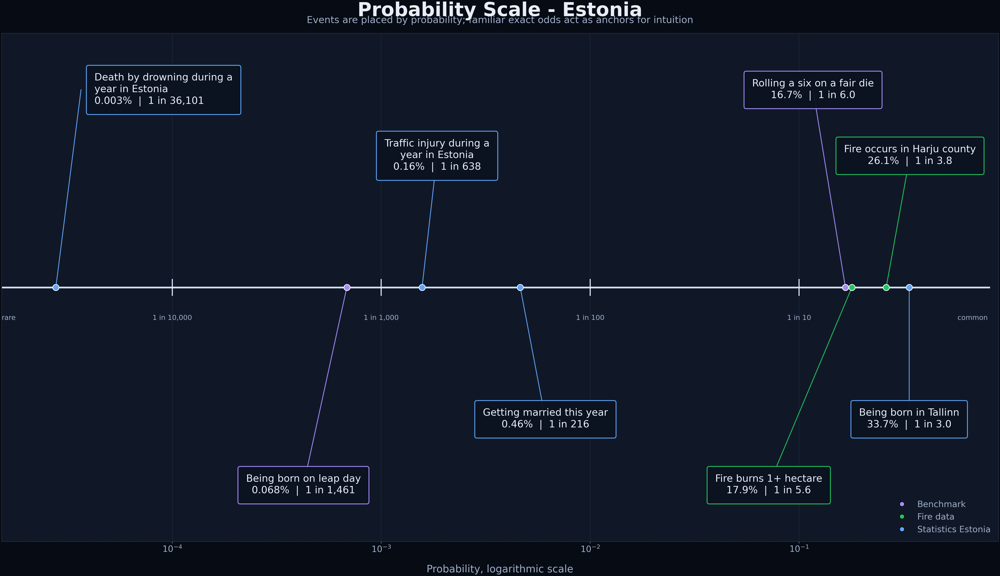

# RMK Data Team Internship 2026: Probability Scale

This repository builds a probability scale for Estonia: a small set of real-world
events placed on one comparable probability axis.

The emphasis is on reproducibility and readable statistical choices rather than a
large front end. The whole workflow is:

1. download raw open-data files,
2. parse each source explicitly,
3. calculate event probabilities,
4. write a clean CSV,
5. render a log-scale chart.

## Data Sources

The implemented build uses official Estonian open-data sources:

- Estonian Rescue Board forest and landscape fires CSV, discovered via the
  Estonian Data Portal / `andmed.eesti.ee`:
  https://opendata.smit.ee/paa/csv/metsa_ja_maastikutulekahjud_jooksev_aasta.csv
- Statistics Estonia PxWeb API:
  - RV11U: live births by county (Tallinn share)
  - RV047: marriages and divorces
  - RV021: total population
  - TS093: persons injured in traffic accidents
  - RV57: accidental drowning deaths per 100,000 population
- Exact probability benchmarks for calibration:
  - rolling a six on a fair die
  - leap-day birthday

The fetch step stores raw responses in `data/raw/`. Generated outputs are written
to `output/`.



## Current Events

The current scale contains 8 events:

| Event | Probability |
| --- | ---: |
| Death by drowning during a year in Estonia | 0.0000277 |
| Being born on leap day | 0.000684 |
| Traffic injury during a year in Estonia | 0.00157 |
| Getting married this year | 0.00463 |
| Rolling a six on a fair die | 0.1667 |
| Fire burns 1+ hectare | 0.179 |
| Fire occurs in Harju county | 0.261 |
| Being born in Tallinn | 0.337 |

Exact values are regenerated from the raw files and saved to `output/events.csv`.

The scale includes:

- 2 exact reference anchors (leap day, fair die)
- 4 Statistics Estonia rates (drowning, traffic injuries, marriages, births in Tallinn)
- 2 Rescue Board fire incident probabilities (Harju county fires, fires burning 1+ hectare)

## Repository Structure

```text
rmk-probability-scale/
  data/
    raw/          # downloaded source files, gitignored
  output/         # generated CSV and chart
  src/
    fetch_data.py
    build_events.py
    plot_scale.py
    main.py
  pyproject.toml
  README.md
  THOUGHTS.md
  LICENSE
```

## Run

Setup and build:

```bash
python -m venv .venv
source .venv/bin/activate
pip install -e .
build-scale
```

Rebuild from existing raw files (without fetching):

```bash
PYTHONPATH=src python3 -m main --no-fetch
```

Download fresh raw data and rebuild:

```bash
PYTHONPATH=src python3 -m main --fetch
```

The raw data is committed to the repository in `data/raw/`.

## Outputs

After running, the project creates:

- `output/events.csv` - event table with probabilities, source names, URLs, and
  calculation methods
- `output/probability_scale.png` - log-scale probability chart

## Interpretation Notes

- Fire-related probabilities are conditional on the observed current-year
  forest and landscape fire incident file.
- Statistics Estonia rates are converted to comparable probabilities
  (`rate per 100` -> `p = rate / 100`, `rate per 100,000` -> `p = rate / 100000`).
- Exact probability benchmarks are included as scale anchors, not as open-data
  claims.
- The chart uses a logarithmic x-axis and side-lane callouts with enforced
  vertical spacing so text labels stay readable.

## License

MIT
